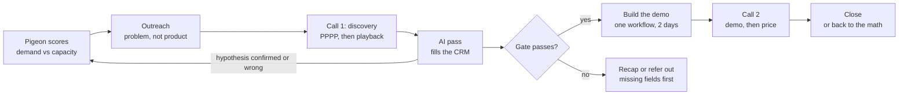

# CappaWork Discovery Playbook

Oct 5, 2026 · Nate Pinches

## Who says yes fastest

Firms with more demand than they can deliver say yes fastest. They can name the work they turn away, the case is revenue rather than savings, and the fix is an ops constraint you can build around. Every question in your PPPP flow now does one of three jobs: confirm that demand, size it, or find the constraint in the way.

| Stage | What it establishes | Anchor question |
| --- | --- | --- |
| Profit | How they make money: requests in, work delivered, job value | "Roughly how many requests come in a month, and how many become work you deliver?" |
| Possibility | The work they turn away, and the business if they could take it | "What work are you turning away or pushing out right now?" |
| Pain | Where work waits in ops, and why | "Where does work wait between 'yes' and 'delivered'?" |
| Proof | Success at six months, and the commitment to show it | "Six months after it ships, what number would show it worked?" |

## Call card for tomorrow

Seven short blocks in 30 minutes, in PPPP order. The follow-ups ride inside each block, so the prospect hears a conversation, not a list.

1. **Frame, 1 min.** "No pitch today. I want to understand how work comes in and how it gets delivered. Then I'll play back what I heard, and we'll decide together if a next step makes sense. If it's not a fit, I'll say so. Okay if I record, so I can listen instead of type?"
2. **Trigger, 2 min.** "What made this the right time to talk?" Then stop talking. If they say they're exploring AI: "Is something going on, like more work coming in than the team can handle?"
3. **Profit, 5 min.** Confirm your research in one sentence. "Roughly how many requests come in a month?" "How many turn into work you deliver?" "What's a typical job worth?" "Walk me through a typical job, from first contact to paid."
4. **Possibility, 5 min.** "What work are you turning away or pushing out right now?" "How many a month, roughly?" "Do those people wait, or go elsewhere?" "If you could say yes to all of it, what would the business look like a year from now?" "If money were no object, how would delivery work?"
5. **Pain, 10 min.** "Where does work wait between 'yes' and 'delivered'?" "Walk me through the last time it backed up." "What happened to that work?" "How long does it sit there?" "Who does that step? Is it you?" Get the hours by bracket. "Is the backlog growing?" Announce the 5 Whys and ask why until the causes run out. "What have you tried, like hiring or new tools?" "What's it like, turning work away?"
6. **Proof, 2 min.** "Six months after it ships, what would extraordinary look like?" "What number would show it?"
7. **Playback and next step, 5 min.** "You're turning away about [N] jobs a month, worth about $[X] by my math. It piles up at [step] because [causes], and you want to get to [target]. Did I get that right?" Then: "If I came back Thursday with [step] running on your data, what would you need to see?" "If it does that, what would stop you?" "Anyone else who'd weigh in?" Ask for the sample data, and send the invite before you hang up.

Guardrails:

- One question at a time.
- Do the math yourself and test it in the playback; never ask the buyer what the problem costs.
- Nothing about what you'd build until the playback is confirmed.
- Talk less than half the time.

## Before the call

Good questions come from knowing the business before you dial. This prep moves the fact-finding off the call, so the call can go to the constraint.

- [ ] Fill the constraint map for this prospect's type: the 3 to 5 places work piles up in firms like theirs, what each costs, and what causes it. Write each as a limit ("can only onboard four clients a month"), not a goal ("more clients").
- [ ] Look for excess-demand evidence: booked-out calendars, waitlists, "not taking new clients", long lead times in reviews, hiring for delivery or coordination roles, recent price increases.
- [ ] Pre-fill what's public: services, prices, team size and systems. On the call, confirm it in one sentence instead of asking.
- [ ] Write the hypothesis in one line: where demand exceeds capacity, the likely constraint, rough monthly value. Save it to `hypothesis` before you dial.
- [ ] Prepare two targeted openers and one stress question from the constraint map, using their likely numbers.
- [ ] Set your defaults (close rate, margin, the owner's revenue per hour) so you can do the math live.
- [ ] Send a short note: no pitch, a playback at the end, a rough count of work they've turned away or deferred to have in mind, and who else should join.
- [ ] Test recording consent and the transcript export into the AI pass.

## Question bank

Each ask fills one field. Must asks fit 30 minutes; If-time asks fill a 45-minute call or move to the recap email.

| Stage | Ask | Field | Tier |
| --- | --- | --- | --- |
| Trigger | What made this the right time to talk? | `deal.trigger` | Must |
| Trigger | Is there a date or event this is tied to? | `deal.timeline_driver` | If time |
| Profit | I saw you [research]. Still right? | `deal.team`, `deal.systems` | Confirm |
| Profit | Roughly how many requests come in a month: closer to 20 or 200? | `deal.demand_volume` | Must |
| Profit | How many of those turn into work you deliver? | `deal.delivered_volume` | Must |
| Profit | What's a typical job worth? | `deal.avg_job_value` | Must |
| Profit | Roughly what do you keep on a job after delivery costs? | `deal.margin` | If time |
| Profit | Walk me through a typical job, from first contact to paid. | `deal.workflow_map` | Must |
| Possibility | What work are you turning away or pushing out right now? | `deal.unserved_demand` | Must |
| Possibility | If nothing comes to mind: if twice the work came in tomorrow, could you deliver it? | `deal.unserved_demand` | Fallback |
| Possibility | How many a month, roughly: a few or dozens? | `deal.unserved_volume` | Must |
| Possibility | Do those people wait, or go elsewhere? | `deal.unserved_outcome` | Must |
| Possibility | If you could say yes to all of it, what would the business look like a year from now? | `deal.ideal_state` | Must |
| Possibility | If money were no object, how would delivery work? | `deal.ideal_workflow` | Must |
| Pain | Where does work wait between "yes" and "delivered"? Or: when [likely step] happens, what has to happen next? | `constraint.constraint` | Must |
| Pain | Walk me through the last time it backed up. | `constraint.example` | Must |
| Pain | What happened to that work? | `constraint.consequences` | Must |
| Pain | How long does work sit there: days or weeks? | `constraint.wait_time` | Must |
| Pain | Who does that step? Is it you? | `constraint.owner_role` | Must |
| Pain | Roughly how many hours a week go to it: 5 or 20? | `constraint.effort` | Must |
| Pain | Is the backlog growing, shrinking or flat? | `constraint.trend` | Must |
| Pain | I'll ask why a few times. Why does it pile up there? What else feeds it? | `constraint.root_causes` | Must |
| Pain | Does [likely cause] play into it? | `constraint.root_causes` | Must |
| Pain | What have you tried, like hiring or new tools? | `constraint.prior_attempts` | Must |
| Pain | Stress question: if demand grew by half next year, where would it break first? | `constraint.consequences` | Once |
| Pain | What's it like, turning work away? | `deal.emotional_state` | Must |
| Proof | Six months after it ships, what would extraordinary look like? What number would show it? | `deal.success_metric` | Must |
| Playback | You're turning away about [N] a month, worth about $[X] by my math. It piles up at [step] because [causes], and you want [target]. Did I get that right? | `deal.validation` | Must |
| Next step | If I came back [call 2 day] with [step] running on your data, what would you need to see? | `deal.demo_acceptance` | Must |
| Next step | If it does that, what would stop you from moving forward? | `deal.objections` | Must |
| Next step | Anyone else who'd weigh in? Can they join? | `deal.stakeholders` | Must |
| Next step | How did you decide on the last tool or vendor like this? | `deal.decision_process` | If time |
| Next step | Can you send a sample [schedule, intake form, job sheet] with client details removed? | `deal.demo_artifacts` | Must |
| Next step | Anything this has to work with or around, like a system you can't change or client-data rules? | `deal.must_work_with` | If time |
| Next step | Send the invite before you hang up. | `deal.call2_at` | Must |

- Possibility comes before Pain on purpose: once they've named the work they turn away, where it piles up is the obvious next question.
- Repeat the Pain asks for a second constraint only once the first is fully covered.
- Skip anything already answered; the AI maps answers by content, not by the order you asked.
- Brackets ("closer to 5 or 50?") are easier to answer than open estimates, and they keep the numbers flowing.

## Handling common moments

Most derailments are the buyer pulling you toward the product or the price too early. Each answer below steers back to demand and capacity.

| Moment | Say or do |
| --- | --- |
| "So what do you do?" in minute two | "We build AI software for founder-led service firms that have more work coming in than they can deliver. Give me 20 minutes on how work flows today, then I'll tell you what I'd build and whether it's worth it." |
| "What does it cost?" before the playback | "Builds start at [floor; $35K on the site today]. Whether it's worth it depends on how much work you're leaving on the table, which is what I want to understand first." |
| They answer the trigger with a wish ("we want to use AI") | "Is something going on that has you looking, like more demand than the team can handle?" Then name the step you suspect. |
| They prescribe a solution ("we need an app") | "What would the app let you take on that you can't now? Walk me through what happens today without it." |
| No defined excess demand | Ask once: "If twice the work came in tomorrow, could you deliver it?" If yes, it's a demand problem, not a capacity problem: still a possible client, but a slower yes. Deprioritize, and don't build a demo. |
| The numbers stay vague | Offer a bracket. If they're still vague, put your estimate in the recap and ask them to correct it. |
| Two or three constraints surface | One Constraint record each. Demo only the one that caps delivery most. |
| The constraint is a missing hire or skill, not process | Say so and point them to someone who can help. |
| They aren't the decision-maker | Ask how decisions like this get made. Build the demo only if the decision-maker joins call 2. |

## CRM schema

Two record types keep every fact in exactly one place: a Deal per company and a Constraint per bottleneck, up to three.

**Deal**

| Field | Holds | Source |
| --- | --- | --- |
| `hypothesis` | One line before the call: where demand exceeds capacity, the likely constraint, rough monthly value | You, pre-call |
| `trigger` | What made now the time | Stated |
| `timeline_driver` | Date or event behind the timing | Stated |
| `team`, `systems` | Headcount, roles, tools | Research, confirmed |
| `demand_volume` | Requests or inquiries per month | Stated |
| `delivered_volume` | Jobs delivered per month | Stated |
| `avg_job_value` | Typical job value | Stated |
| `margin` | What they keep per job | Stated |
| `workflow_map` | First contact to paid | Stated |
| `unserved_demand` | The work they turn away or defer, in their words | Stated |
| `unserved_volume` | How much of it, per month | Stated |
| `unserved_outcome` | Whether it waits or goes elsewhere | Stated |
| `ideal_state` | The business if they could say yes to all of it | Stated |
| `ideal_workflow` | How delivery would work if money were no object | Stated |
| `emotional_state` | What turning work away is like for them | Stated |
| `success_metric` | Metric, baseline, six-month target | Stated |
| `validation` | Playback confirmed, corrected or disputed | Stated |
| `demo_acceptance` | What they need to see on call 2 | Stated |
| `objections` | What would stop them | Stated |
| `stakeholders` | Who weighs in, and who attends call 2 | Stated |
| `decision_process` | How the last similar decision was made | Stated |
| `demo_artifacts` | Sample files promised, then received | Stated |
| `must_work_with` | Systems or data rules to respect | Stated |
| `call2_at` | Booked date and time | Stated |
| `hypothesis_result` | Confirmed, partial or wrong | Computed |
| `unserved_value_monthly` | Unserved volume × job value × margin | Computed |
| `unlocked_value_monthly` | The share a fix would unlock, in dollars | Computed |
| `change_risk` | Effort and risk of switching | Computed |
| `case_summary` | Demand, capacity, constraint, value, target | Computed |
| `coverage` | Share of Must fields with evidence | Computed |
| `decision` | Build, recap first, deprioritize, or refer out | Computed |

**Constraint**

| Field | Holds | Source |
| --- | --- | --- |
| `constraint` | Where work piles up, in their words | Stated |
| `example` | The last time it backed up | Stated |
| `consequences` | What happened to that work | Stated |
| `wait_time` | How long work sits there | Stated |
| `owner_role` | Who does that step | Stated |
| `effort` | Hours a week it takes | Stated |
| `trend` | Backlog growing, shrinking or flat | Stated |
| `root_causes` | The processes and tools behind it | Stated |
| `prior_attempts` | What they've tried, including hiring | Stated |
| `tied_to_capacity` | Whether it limits work delivered, or is only an annoyance | Computed |
| `profit_lever` | Customers, job value, frequency or margin | Computed |
| `capacity_unlocked` | Extra jobs a month if fixed | Computed |
| `impact_monthly` | Dollars a month, math shown | Computed |
| `fixable` | Yes, partial or no | Computed |
| `primary` | The one to demo | AI proposes, you confirm |

Rules that prevent cross coverage:

1. One quote supports one field. If it fits two, the Constraint record wins over the Deal.
2. Stated means the buyer said it, with a quote and a timestamp. Computed means math with labeled assumptions. Never mix the two.
3. The limit goes in `constraint`; the processes and tools causing it go in `root_causes`. Fix the causes and the limit lifts.
4. A field the call never touched reads "not covered"; one asked but unanswered reads "no answer". Never blank.
5. Recap corrections overwrite the field, and the CRM keeps the history.

## Sizing the opportunity and the go/no-go gate

Build the demo only when all seven tests pass. Otherwise send the recap first, deprioritize, or refer them on.

Size it three ways: what the constraint costs each month, what it takes to change, and what the unlocked capacity is worth at six months. Count revenue first; owners pay to grow, not to save hours they'd work anyway.

| Where work piles up | What it costs | Monthly value |
| --- | --- | --- |
| Replies to new inquiries | Leads that go elsewhere | lost inquiries × close rate × avg job value |
| Quotes and proposals | Bids lost to faster competitors | late or unsent quotes × win rate × avg job value |
| Scheduling and dispatch | Jobs delivered per month, capped | extra jobs a month × avg job value × margin |
| Onboarding new clients | New clients started per month, capped | extra clients a month × first-year value ÷ 12 |
| Owner review or approval | Owner hours not spent selling or delivering | owner hours freed × owner's revenue per hour |
| Rework and errors | Capacity spent twice | rework hours × revenue per delivery hour |

The gate:

| # | Test | Passes when | Fields |
| --- | --- | --- | --- |
| 1 | Defined excess demand | They name the work they turn away or defer, with a number | `deal.unserved_demand`, `deal.unserved_volume` |
| 2 | Ops is the constraint | The primary constraint's causes are processes or tools you build, not a missing hire or skill | `constraint.fixable` |
| 3 | They agree | The playback was confirmed or corrected, not disputed | `deal.validation` |
| 4 | Urgency | A trigger or timeline exists, or the backlog is growing | `deal.trigger`, `constraint.trend` |
| 5 | Commitment | Sample data promised, and the decision-maker attends call 2 | `deal.demo_artifacts`, `deal.stakeholders` |
| 6 | The math clears the price | 12-month unlocked value is at least 3× the likely price | `deal.unlocked_value_monthly` |
| 7 | The record is complete | Every Must field has evidence or a question in the recap | `deal.coverage` |

A firm that fails test 1 can still buy, but it has a demand problem rather than a capacity problem, and it buys slower: deprioritize rather than disqualify. The 3× rule is a starting point: even if your estimate is double the truth, the buyer still recovers 1.5× the price in a year. At a $35K build that means about $8,750 a month of unlocked value; adjust it when pricing changes.

## Transcript to demo: the extraction pass

One pass per transcript fills the CRM, drafts the recap and writes the demo brief. Run it as an Inngest function, with the Zod schema below as structured output through the Vercel AI SDK.

1. The transcript lands from the recording tool.
2. The model extracts against the schema.
3. Deal and Constraint records are written.
4. The recap draft comes to you to review and send.
5. The demo brief is written only when the gate says Build.

```text
You are CappaWork's discovery analyst. CappaWork builds production AI software for founder-led service businesses on one repeatable client delivery platform: client portal, tasks, CRM, pipeline, billing and AI. The best-fit clients have more demand than they can deliver. Your job is to measure that demand and find the ops constraint that caps delivery.

INPUTS
1. TRANSCRIPT: the discovery call, with timestamps and speaker labels.
2. RESEARCH: pre-call notes and the one-line hypothesis.
3. CONSTRAINT MAP: where work typically piles up for firms like this, what it costs, and what causes it.
4. DEFAULTS: close rate, margin and owner revenue per hour. Use them only when the buyer gave no number.
5. PRICE: the likely price for this build.

RULES
- Fill every field in the schema. Stated fields use only the buyer's words and carry a verbatim quote and timestamp.
- A field the call never touched is "not covered". A field asked but unanswered is "no answer". Never guess, and never leave a field blank.
- One quote supports one field. If it fits two, the Constraint record wins over the Deal.
- Create one Constraint per distinct bottleneck, at most three. The limit goes in constraint; the processes and tools causing it go in root_causes.
- Set tied_to_capacity to false when the issue doesn't limit work delivered, and add a question that would test whether it does.
- Computed fields show the arithmetic and label every assumption the buyer did not state.
- Value unserved demand through the Profit Formula: customers × average job value × frequency × margin. Count revenue the constraint blocks before hours it wastes.
- Never invent numbers, names, systems or quotes.

MUST FIELDS
trigger, demand_volume, delivered_volume, avg_job_value, workflow_map, unserved_demand, unserved_volume, unserved_outcome, ideal_state, ideal_workflow, emotional_state, success_metric, validation, demo_acceptance, objections, stakeholders, demo_artifacts, call2_at; and on the primary Constraint: constraint, example, consequences, wait_time, owner_role, effort, trend, root_causes, prior_attempts.

GATE (all seven must pass for Build)
1. The buyer names work they turn away or defer, with a number.
2. The primary constraint's causes are processes or tools CappaWork builds.
3. The buyer confirmed or corrected the playback.
4. A trigger or timeline exists, or the backlog is growing.
5. Sample data was promised, and the decision-maker attends call 2.
6. 12-month unlocked value is at least 3 × PRICE.
7. Every Must field has evidence or a question in the recap.
If test 1 fails, the decision is Deprioritize. If test 2 fails because the cause is people or skills, the decision is Refer out.

OUTPUT, IN ORDER
A. JSON matching the schema.
B. Hypothesis check: confirmed, partial or wrong, with the evidence.
C. Gate: each test passed or failed with the field it rests on, then Build, Recap first, Deprioritize or Refer out.
D. Recap email in my voice: demand, delivered and unserved volumes; where work piles up and why; my monthly value estimate with the assumptions to correct; up to three questions for uncovered Must fields; call 2's agenda and attendees; the data request.
E. Demo brief, only if the gate says Build: the primary constraint; the one workflow to show; the platform modules it uses; the data shape from the sample; how it meets each acceptance criterion; the capacity it should unlock; what is real and what is mocked; open risks.
```

```ts
import { z } from "zod";

// A buyer statement plus the evidence behind it.
const stated = z.object({
  value: z.string(), // "not covered" or "no answer" when absent
  quote: z.string().optional(),
  at: z.string().optional(), // transcript timestamp
});

// A calculation, never mixed with buyer statements.
const computed = z.object({
  value: z.string(),
  math: z.string(),
  assumptions: z.array(z.string()),
});

export const Constraint = z.object({
  constraint: stated, // where work piles up, in their words
  example: stated,
  consequences: stated,
  wait_time: stated,
  owner_role: stated,
  effort: stated,
  trend: stated,
  root_causes: z.array(stated), // processes and tools
  prior_attempts: stated,
  tied_to_capacity: z.boolean(),
  profit_lever: z.enum(["customers", "avg_job_value", "frequency", "margin"]),
  capacity_unlocked: computed,
  impact_monthly: computed,
  fixable: z.enum(["yes", "partial", "no"]),
  primary: z.boolean(),
});

export const Deal = z.object({
  hypothesis: z.string(),
  trigger: stated,
  timeline_driver: stated,
  team: stated,
  systems: stated,
  demand_volume: stated,
  delivered_volume: stated,
  avg_job_value: stated,
  margin: stated,
  workflow_map: stated,
  unserved_demand: stated,
  unserved_volume: stated,
  unserved_outcome: stated,
  ideal_state: stated,
  ideal_workflow: stated,
  emotional_state: stated,
  success_metric: stated,
  validation: z.enum(["confirmed", "corrected", "disputed", "not done"]),
  demo_acceptance: stated,
  objections: z.array(stated),
  stakeholders: z.array(stated),
  decision_process: stated,
  demo_artifacts: stated,
  must_work_with: z.array(stated),
  call2_at: stated,
  constraints: z.array(Constraint).max(3),
  hypothesis_result: z.enum(["confirmed", "partial", "wrong"]),
  unserved_value_monthly: computed,
  unlocked_value_monthly: computed,
  change_risk: computed,
  case_summary: z.string(),
  coverage: z.number().min(0).max(1),
  decision: z.enum(["build", "recap_first", "deprioritize", "refer_out"]),
});
```

## After the call: the recap email

Send it within a few hours. It's the written playback: the buyer's corrections fix your numbers before you price, and the build starts from what they confirmed.

```markdown
Subject: What I heard, and Thursday

[Name], thanks for the time today. Here's what I heard, so you can correct anything I got wrong.

Demand: about [demand volume] requests a month. You're delivering about [delivered volume] and turning away or deferring about [unserved volume].

Where it piles up: [constraint, in their words]. Work waits about [wait time], and it mostly lands on [owner role].

Why: [root causes].

What it's worth: about $[X] a month in work you can't take on, by my math, assuming [assumptions]. Tell me where I'm off.

Where you want to be: [ideal state], measured by [success metric].

Thursday at [time]: I'll show [constraint step] running on a sample of your data. You said you'd need to see [acceptance criteria]. [Stakeholders] will join.

To build it, I need [sample] by [Wednesday noon].

A few things I didn't get to: [up to three questions].

Nate
```

## Call 2: demo and pricing

Call 2 shows the constraint lifting on the buyer's own data, then prices against the work they're turning away. Demo only the constraint discovery confirmed; if you'd be guessing at what to show, discovery isn't finished.

1. **Reconfirm the numbers, 5 min.** Read back the recap, and ask whether anything has changed since the first call.
2. **Demo the constraint step, 15 min.** Walk each acceptance criterion and tie each part to a root cause. After each part, ask: "How would this change what you can take on?"
3. **Re-size the opportunity, 5 min.** Unlocked jobs a month × job value, set against their six-month target.
4. **Price, 10 min.** Price against the unlocked value and the payback. For example: "You're turning away about $12K a month. The build is $35K, so it pays back in about three months." Then stop talking. Offer two scopes, never a discount.
5. **Decide, 10 min.** Ask what they want to do, and agree on a start date and the next document. If they push on price, go back to the numbers, not to a discount.

## Targeting: finding firms with more demand than capacity

The fastest yeses have more demand than they can deliver, so Pigeon should score demand and capacity, not budget.



The hypothesis you write before each call gets scored after it, so the signals that predict real excess demand rise and the rest drop out.

- **Demand signals:** booked-out calendars or waitlists, "not taking new clients", reviews about long waits or slow replies, recent price increases.
- **Capacity signals:** a small team for the demand they show, hiring for delivery or coordination roles, the owner still doing delivery, intake by phone or contact form only.
- **Trigger events:** a new location, a growth spurt, a key person leaving, a peak season, a new compliance rule.
- **Score in dollars, not budget:** excess demand × job value × the share of the constraint a build could take over.
- **Outreach:** name what you saw ("booked out through November"), say what it usually means ("the bottleneck is usually scheduling, not the work"), and ask whether that's what's happening. It fits your LinkedIn video messages.
- **Score the hypothesis:** write `hypothesis` before the call and `hypothesis_result` after. After 20 to 30 calls, keep the signals that predicted real excess demand and drop the rest.
- **Tools:** the signal finder on cappawork.com plus Apollo cover signals and contacts.
